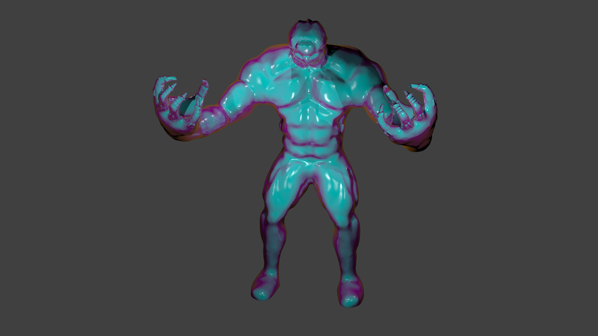

# OpenGL-Graphics-Engine
Graphics Engine made from the ground up entirely using OpenGL, GLFW, C++, GLSL. This engine enables user to easily load models and textures for rendering and viewing.

# Features/Details
* Windows Platform.
* lighting is based of the Phong shading model (diffuse, ambient, specular).
* Implemented Directional Lights, Point Lights, and Spot-light.
* Able to easily create Lights, Objects, and Sounds via helper classes.
* Textures can be added singular or grouped to a particular model.
* fragmentShaders and VertexShaders are implemented for generic models and lighting.
* Camera class enables user to modify the generic camera (allows both 3rd persons and 1st person view).
* implemented sound modules with OpenAL.
* Models are created and imported from blender and other 3D modeling software’s.
* Anti-aliasing functionality.
* Sky-Box functionality.
* Depth and Stencil test functionality.
* Face-culling functionality.
* Fast instancing functionality to greatly increase rendering speed.
* Easy Frame buffer to Texture functionality.

# Future development
* Implement a quaternion-based camera to ensure the removal of gimbal lock. 
* Implement GUI functionality to easily added models via drag and drop.
* Implement save state functionality of scene.
* Easy access engine to add and remove from the scene.
* Bloom/ emission effects.
* ray tracing implementation to render scenes.
* Implementing PBR (Physical Based Rendering).
* Easier stencil buffer use.
* Multiplatform implementation. 

# How I got Started
A very helpful site that gets you started on learning OpenGL: [LearnOpenGL](https://learnopengl.com/).

# Tools used in the Project:
* OpenGL
* OpenCV
* GLSL
* C++
* GLFW
* Assimp
* ImGui
* OpenAL

# Usage in Other Projects
1. [3D-DIsplay-Simulation](https://github.com/vinaykomaravolu/3D-Display-Simulation)
2. [VText](https://github.com/vinaykomaravolu/VText)
3. [openGL-BF-Wrappers](https://github.com/vinaykomaravolu/openGL-BF-Wrappers)

# Usage
Clone repository and run GraphicsEngineV.exe in release folder.

# Demonstration

## Rendered [Sponza](https://github.com/KhronosGroup/glTF-Sample-Models/tree/master/2.0/Sponza) Demo

## Model View Demo

## Skybox Lighting Demo

## Future Goal

This image is rendered in [Blender](https://www.blender.org/). This rendered image is what I aim to achieve with my engine.

